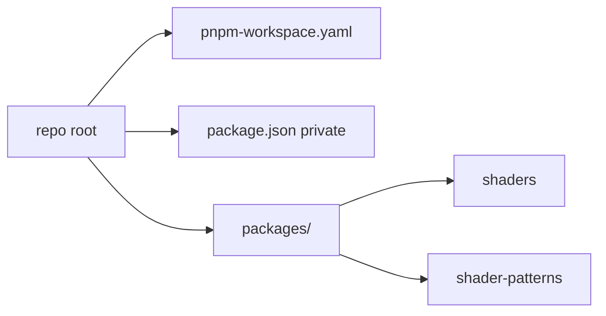

# pnpm workspace: two Three + Vite shader projects

## Target layout

The repo root stays at `[/home/subikstha/projects/three/shaders](/home/subikstha/projects/three/shaders)` (your current “parent folder”). Two apps live as workspace packages so names stay filesystem-safe while still matching your intent:

| Display intent  | On-disk package folder     | `package.json` `name`                                                                                 |
| --------------- | -------------------------- | ----------------------------------------------------------------------------------------------------- |
| shaders         | `packages/shaders`         | e.g. `@local/shaders` or `shaders`                                                                    |
| shader patterns | `packages/shader-patterns` | e.g. `@local/shader-patterns` (human title in README or HTML `<title>` if you want “Shader patterns”) |

Using `shader-patterns` as the folder name avoids spaces and matches npm/pnpm conventions; the UI can still say “Shader patterns”.

## Root files

1. `**[pnpm-workspace.yaml](pnpm-workspace.yaml)**`
  - `packages:` entry pointing at `packages/*` (or explicit `packages/shaders` and `packages/shader-patterns`).
2. `**[package.json](package.json)**` (root)
  - `"private": true`  
  - Optional `"packageManager": "pnpm@<version>"` for Corepack consistency  
  - Scripts such as `dev:shaders` / `dev:patterns` that run `pnpm --filter <name> dev` so you can start each app from the root without `cd`.
3. `**.npmrc**` (optional but common)
  - e.g. `shamefully-hoist=false` (default) is fine for Vite; only add settings if you hit resolution issues.

## Shared dependencies strategy

Each app needs its own `package.json` so `vite` runs with correct `node_modules` resolution from that package directory. Pin the **same versions** of these four in both packages:

- `three`
- `vite`
- `vite-plugin-restart`
- `lil-gui`

**Recommended:** use a [pnpm catalog](https://pnpm.io/catalogs) in the root `pnpm-workspace.yaml` / `package.json` (pnpm 9+) so version numbers live in one place; both apps reference `catalog:` for those deps. If you prefer maximum simplicity without catalogs, duplicate the same semver ranges in both `package.json` files (pnpm still dedupes in the store).

## Per-app scaffold (both packages, mirrored minimal structure)

For each of `packages/shaders` and `packages/shader-patterns`:

- `**package.json`** — `name`, `type: "module"`, `scripts`: `"dev"`, `"build"`, `"preview"`, and the four dependencies above.
- `**vite.config.js`** — ESM config importing `vite-plugin-restart` and wiring it (e.g. restart on changes to `**/*.glsl` if you add shaders later; a simple `**/*` or `*.html` is enough to start).
- `**index.html**` — entry pointing at `/src/main.js`.
- `**src/main.js**` — minimal Three.js scene (renderer, scene, camera, mesh or clear color) plus `lil-gui` hooked to one obvious parameter so you verify both libs load. Slightly different copy per app (e.g. different background color or title) so you can tell them apart in the browser.

No TypeScript unless you ask for it; plain JS keeps the setup small.

## Commands you will run after implementation

From the repo root:

- `corepack enable` (once per machine, if you use `packageManager` in root `package.json`)
- `pnpm install`
- `pnpm --filter <pkg-name> dev` or the root convenience scripts

## Summary

- Monorepo root at your existing empty folder with `pnpm-workspace.yaml` + private root `package.json`.  
- Two packages under `packages/shaders` and `packages/shader-patterns`, each a runnable Vite app using three, vite-plugin-restart, and lil-gui.  
- Single source of truth for versions via pnpm catalog (or duplicated identical ranges).

